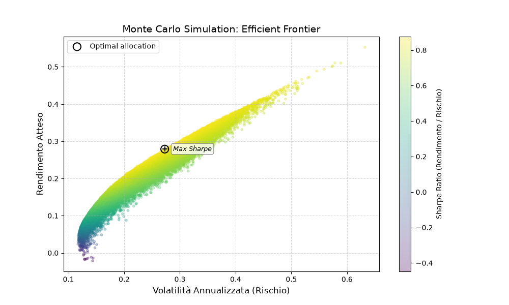

# Quantitative Portfolio Optimization Research Project


A modular Python-based quantitative finance project designed to explore the principles of Modern Portfolio Theory (MPT), Efficient Frontier construction, and risk-adjusted portfolio optimization.

---

## 📂 Repository Structure

```text
quant-project-1/
│
├── data_ingestion.py      # Market data download & cleaning (yFinance)
├── financial_core.py      # Returns & covariance matrix math
├── optimizer.py           # Vectorized Monte Carlo & Sharpe optimization
├── visualizer.py          # Matplotlib Efficient Frontier rendering
├── main.py                # Main orchestrator
│
├── docs/
│   └── efficient_frontier.png
│
├── requirements.txt
├── .gitignore
├── LICENSE
└── README.md
```

---

## 🏗️ Architecture & Modules

The system follows a layered modular architecture to separate concerns:

### Data Layer
Robust market data acquisition with ticker validation, error handling, and rate-limiting protection.

### Financial Analytics
Computation of daily returns, annualized expected returns, and covariance matrices.

### Optimization Engine
Uses NumPy vectorization to generate and evaluate large sets of portfolios while enforcing user-defined volatility constraints.

### Presentation Layer
Visualizes the risk-return landscape and highlights the Maximum Sharpe allocation.

---

## 🧮 Mathematical Foundations (Sharpe Ratio)

The optimization engine evaluates portfolios based on risk-adjusted performance using the True Sharpe Ratio:

```text
Sharpe = (Rₚ - Rf) / σₚ
```

Where:

- **Rₚ** = Expected Portfolio Return
- **Rf** = Risk-Free Rate
- **σₚ** = Portfolio Volatility

---

## 📊 Example Result

When simulating an allocation across large-cap US equities and treasury bonds, the framework outputs the mathematically optimal allocation under the specified risk threshold:

```text
[OPTIMAL PORTFOLIO FOUND]

Expected Return: 29.22%
Volatility:      28.73%
Sharpe Ratio:    0.88

[ALLOCATION WEIGHTS]

VOO:  63.09%
PLTR: 31.15%
QQQ:   5.38%
TLT:   0.38%
```

---

## 📈 Efficient Frontier

The chart below shows the simulated portfolios colored by Sharpe Ratio. The highlighted point represents the maximum risk-adjusted allocation discovered by the optimization engine.



---

## 💻 Technology Stack

- Python 3.13
- NumPy (Linear Algebra & Vectorization)
- Pandas (Time Series Data Management)
- Matplotlib (Data Visualization)
- yFinance (Market Data Ingestion)

---

## 🛠️ Installation & Usage

### Clone the Repository

```bash
git clone https://github.com/andrearadivo/quant-project-1.git

cd quant-project-1
```

### Create and Activate a Virtual Environment

```bash
python -m venv .venv
```

Windows:

```bash
.venv\Scripts\activate
```

MacOS / Linux:

```bash
source .venv/bin/activate
```

### Install Dependencies

```bash
pip install -r requirements.txt
```

### Run the Engine

```bash
python main.py
```

---

## 🧠 Key Learnings

Through the development of this framework, I gained practical experience with:

- Modern Portfolio Theory (MPT)
- Efficient Frontier Construction
- True Sharpe Ratio Optimization
- Financial Time Series Analysis
- NumPy Vectorization
- Risk-Constrained Portfolio Construction
- Object-Oriented Design
- Modular Software Architecture

---

## 🗺️ Long-Term Evolution & Future Research

Future development phases will transition this project from an exploratory simulator into a complete quantitative research and backtesting suite.

### ☐ Mathematical Optimization

Replace Monte Carlo sampling with:

```python
scipy.optimize.minimize()
```

using SLSQP for precise Efficient Frontier computation.

### ☐ Backtesting Engine & Benchmarking

Implement:

- Portfolio Rebalancing
- Transaction Costs
- Equity Curve Generation
- Benchmark Comparison (SPY, VOO, 60/40 Portfolio)

### ☐ Advanced Risk Analytics

Introduce:

- Maximum Drawdown
- Sortino Ratio
- Calmar Ratio

### ☐ Advanced Asset Allocation Models

Explore:

- Black-Litterman Optimization
- Risk Parity
- Hierarchical Risk Parity (HRP)

---

## 🚀 Project Vision

This project represents my ongoing journey into quantitative finance, portfolio construction, and systematic investment research.

The long-term objective is to evolve this educational optimizer into a complete quantitative research and portfolio management framework.